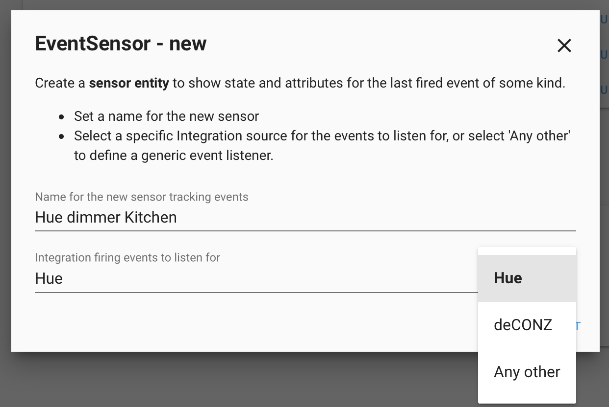
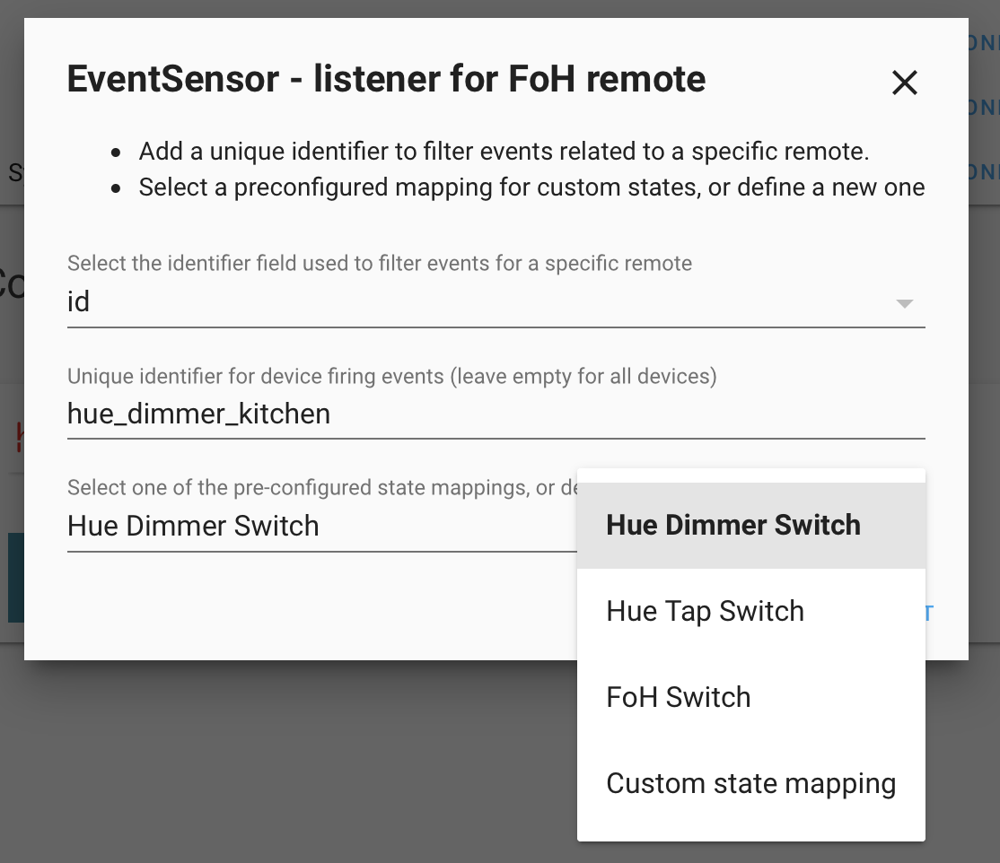
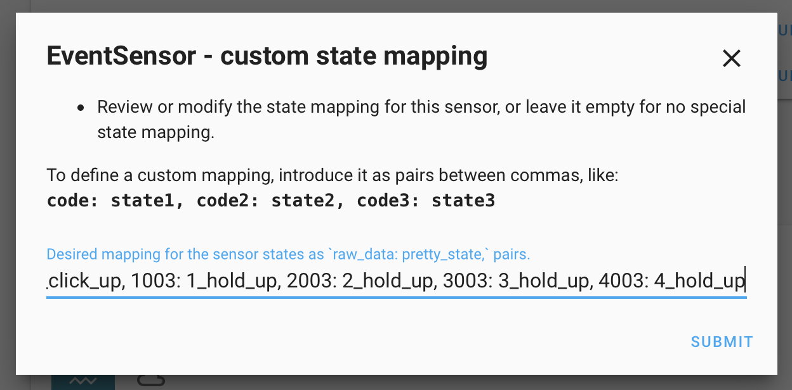
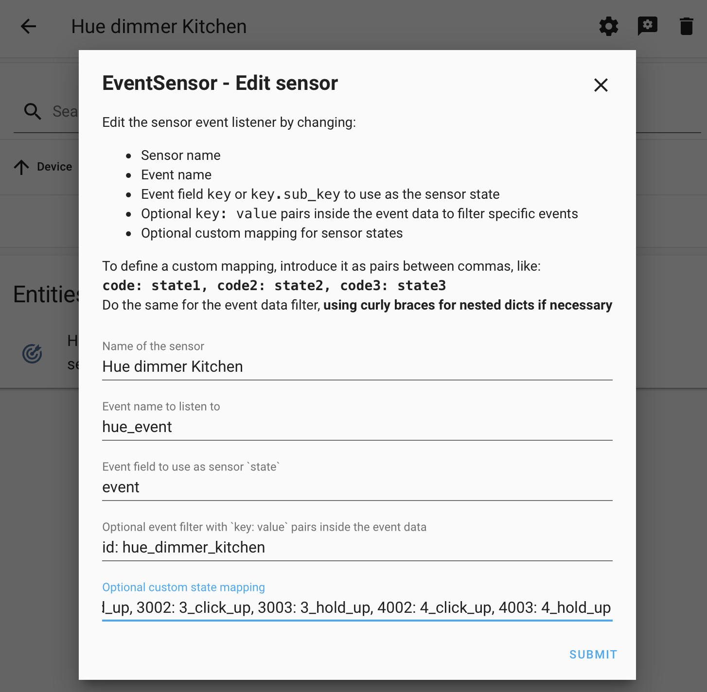

[](https://github.com/custom-components/hacs)
[](https://github.com/ambv/black)

<br><a href="https://www.buymeacoffee.com/azogue" target="_blank"></a>

# Event sensor

Custom integration to create sensors that track, represent and store specific Home Assistant **events**.

Created to assign HA entities for ZigBee switches that only generate events when pressed,
but could be useful in other scenarios where some specific event needs to be tracked.

## Installation

### HACS _(preferred method)_

**Add the integration in [HACS](https://hacs.xyz/)** and start using it without any HA restart :)

### Manual install

Place the `custom_components` folder in your configuration directory
(or add its contents to an existing `custom_components` folder).

## Configuration

2 ways of configuration are implemented: **via UI** from the Integrations menu,
and, as _legacy mode_, via manual YAML config as a _sensor platform_.

Sensors configured manually in YAML will log a deprecation warning, advising to remove the yaml,
after importing them to config entries handled via Integrations UI.

### Wizard for UI config _(preferred method)_

Go to the Integrations menu, look for `EventSensor`, and start the wizard.

1. Set a name for the sensor and a HA integration as source for the events to listen for.
  For _Friends of Hue_ remotes, select "Hue" or "deCONZ" to preconfigure the event sensor. Select "Any other" otherwise.
2. If Hue or deCONZ are selected, use step 2 to set a unique identifier to filter events for an specific device. Leave that field empty to create a sensor showing button presses for all devices. 2 options are shown, filter by `id` or by `unique_id`:
   * `id` is the _slugified_ version of the given name for the device, so for a Hue dimmer battery sensor named `sensor.hue_dimmer_kitchen_battery_level`, the `id` would be "hue_dimmer_kitchen".
   * `unique_id` is serial number of the device, (example: "00:17:88:01:10:3e:3a:dc-02-fc00").

   Last field is to select one of the pre-configured state mappings for Hue remotes. Set it as "Custom state mapping" to define your own.
3. Use the last step to review or customize the optional state mapping and confirm the sensor creation.

   Follow the instructions to introduce the mapping as a text in that field, as pairs between commas, with the syntax: `code: state1, code2: state2, code3: state3`.

  |  | 
:---:|:---:|:---:


#### Generic sensor definition

* When "Any other" is selected in step 1, the next step shows a full manual configuration for the sensor.

* For any loaded event sensor, the Options menu is available to show or **edit** all sensor parameters,
  so any change in the sensor definition can be made without removing + adding a new one, and of course without any HA restart.



### Manual yaml config

Once installed add to your yaml configuration the desired sensors like in the next examples.

* Optionally filter events with key-value pairs inside the event data (like identifiers for item generating the event).
* Optionally define a `state_map` to define custom states from the raw event data value.

#### A [Hue tap switch](https://www2.meethue.com/en-us/p/hue-tap-switch/046677473365) integrated in HA via [deCONZ integration](https://www.home-assistant.io/integrations/deconz/)

```yaml
sensor:
  - platform: eventsensor
    name: Tap switch last press
    event: deconz_event
    event_data:
      unique_id: 00:00:00:00:00:45:51:23
    state: event
    state_map:
      34: 1_click
      16: 2_click
      17: 3_click
      18: 4_click
```

When some event that matches the filters is received, the sensor is updated:

```json
{
    "event_type": "deconz_event",
    "data": {
        "id": "hue_tap_switch_1",
        "unique_id": "00:00:00:00:00:45:51:23",
        "event": 16
    },
    "origin": "LOCAL",
    "time_fired": "2020-03-28T18:23:58.439746+00:00",
    "context": {
        "id": "298225779b1c42e7989eff0a62a4a34c",
        "parent_id": null,
        "user_id": null
    }
}
```

Making the sensor state equal to "2_click".

#### A Hue dimmer switch integrated in HA via [hue integration](https://www.home-assistant.io/integrations/hue/)

```yaml
sensor:
  - platform: eventsensor
    name: Dimmer switch last press
    event: hue_event
    event_data:
      id: switch_bedroom
    state: event
    state_map:
      # these will probably be missed (because of the hue polling)
      1000: 1_click
      2000: 2_click
      3000: 3_click
      4000: 4_click
      1001: 1_hold
      2001: 2_hold
      3001: 3_hold
      4001: 4_hold
      # these will be detected always
      1002: 1_click_up
      2002: 2_click_up
      3002: 3_click_up
      4002: 4_click_up
      1003: 1_hold_up
      2003: 2_hold_up
      3003: 3_hold_up
      4003: 4_hold_up
```

#### A sensor to catch the event data when new devices are detected

When the legacy `device_tracker` detects a new entity in the network
it fires a specific event carrying the MAC address, host name and new entity_id.

To make a sensor to retain that data until another new device is detected, use this:

```yaml
sensor:
  - platform: eventsensor
    name: Last detected device
    event: device_tracker_new_device
    state: mac
```

#### A sensor to retain the last activated scene

By listen to `call_service` when `domain: scene, service: turn_on`,
using dot notation to use the activated scene as the sensor state
with `state: service_data.entity_id`, and then map the scene entities with pretty names
for the sensor.

```yaml
sensor:
  - platform: eventsensor
    name: Last scene
    event: call_service
    state: service_data.entity_id
    event_data:
      domain: scene
      service: turn_on
    state_map:
      scene.evening_light: Evening
      scene.afternoon_light: Afternoon
      scene.other: Other scene
      # ...```

#### Sensor Configuration

key | optional | type | default | description
-- | -- | -- | -- | --
`name` | False | string | | Name for the event sensor
`event` | False | string | | Name of the event to track.
`event_data` | True | dict | Empty (all events) | A dict with key-value pairs required in the event data, to filter specific events.
`state` | False | string | | Event data key used for the sensor state.
`state_map` | True | dict | | State conversion from raw data in event to desired state.
